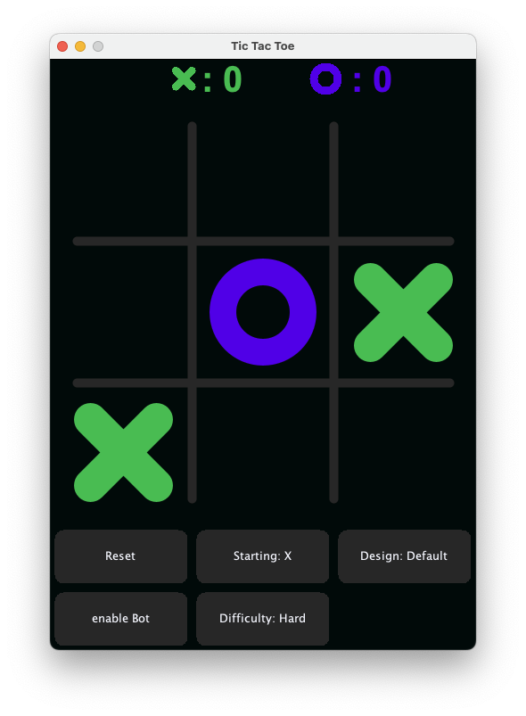
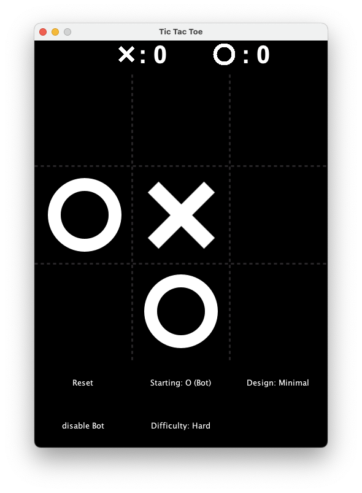

# Java TicTacToe
Ein klassisches Tic Tac Toe spiel für ein bis zwei Personen. 
- Zwei-Spieler-Modus: Spiele gegen einen Freund.
- Einzelspieler-Modus: Spiele gegen den Computer mit unterschiedlichen Schwierigkeitsstufen.

